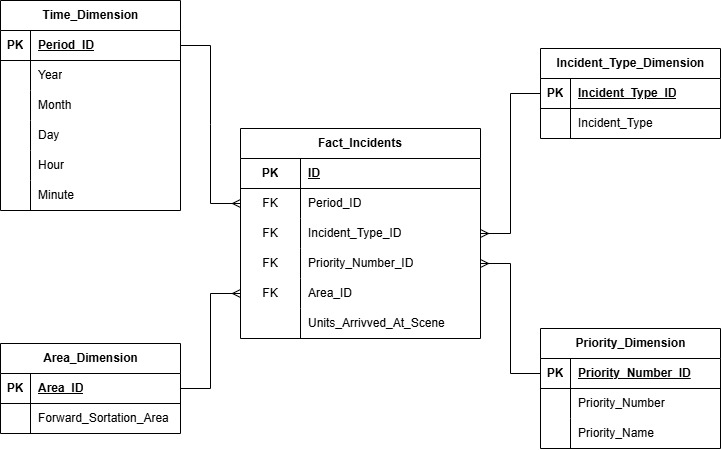

# SSIS ETL Pipeline for Toronto Paramedic Services

🚨 **Turning Paramedic Data into Actionable Insights** 🚨

This repository contains an SSIS ETL pipeline that processes **5 years of Toronto paramedic incidents data (2017-2022)**. The pipeline transforms millions of rows of data into actionable insights, helping uncover patterns to improve response times and resource allocation.

---

## **Entity-Relationship (ER) Diagram**

The structured relationships in the data model are defined as follows:

- **Fact_Incidents** sits at the center and links to the following dimensions:
  - **Time_Dimension**
  - **Incident_Type_Dimension**
  - **Priority_Dimension**
  - **Area_Dimension**



This ER diagram serves as a visual blueprint, guiding the ETL process to ensure efficient query performance and accurate reporting.

---

## **ETL Process Breakdown**

### 📥 **1. Extracting Data**
- Data is sourced from multiple CSV files containing detailed records of:
  - Paramedic dispatches
  - Incident types
  - Priorities
  - Geographic areas
- The raw data is loaded into a **staging table**, serving as the starting point for transformations.

### 🔄 **2. Transforming Data**
The transformation process involves:

- **Time Dimension**:
  - Breaking down dispatch times into `Year`, `Month`, `Day`, `Hour`, and `Minute` to support granular time-based analysis.

- **Incident Type Dimension**:
  - Categorizing emergencies (e.g., medical, fire, traffic) for incident pattern analysis.

- **Priority Dimension**:
  - Organizing response priority levels to gauge urgency.

- **Area Dimension**:
  - Mapping incidents by **Forward Sortation Area (FSA)** for geospatial analysis.

### 📊 **3. Loading Data**
- All numerical and categorical data is loaded into the **Fact_Incidents** table.
- Fact_Incidents connects to the Time, Incident Type, Priority, and Area dimensions.
- Key metrics such as **Units Arrived At the Scene** are stored in the fact table, enabling detailed reporting and insights.

---

## **Impact of the ETL Pipeline**

This pipeline enables insightful analysis with significant real-world implications:

- **Data-driven decisions** in real-time emergency response.
- Visualization of **high-incident areas** for proactive resource deployment.
- **Predictive modeling** based on response times and incident patterns.

By turning data into actionable insights, this project aims to enhance paramedic strategies, reduce response times, and ultimately save lives.

---

## **Repository Structure**

- `/ETL`: Contains SSIS packages and configuration files.
- `/Data`: Sample CSV files used for the ETL process.
- `/Documentation`: ER diagram and process flow documentation.

---

## **Getting Started**

1. Clone this repository:
   ```bash
   git clone https://github.com/NavleenSandhu/ETL-Toronto-Paramedic-Services.git
   ```

2. Open the project in SQL Server Data Tools (SSDT).

3. Configure data sources and connection strings as required.

4. Execute the ETL process to transform and load the data.